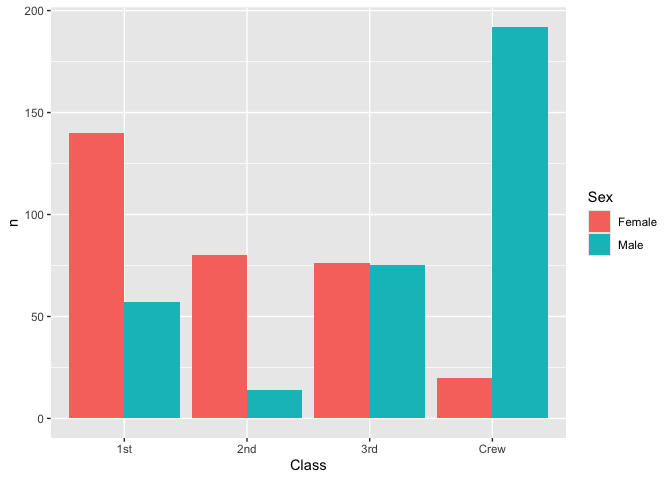
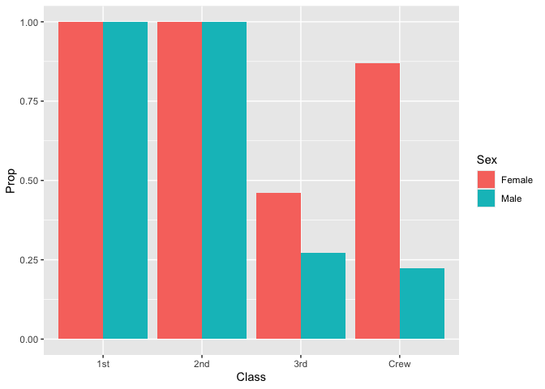
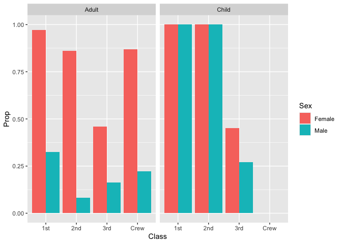

RMS Titanic
================
Carter Harris
2020-

- [Grading Rubric](#grading-rubric)
  - [Individual](#individual)
  - [Submission](#submission)
- [First Look](#first-look)
  - [**q1** Perform a glimpse of `df_titanic`. What variables are in
    this
    dataset?](#q1-perform-a-glimpse-of-df_titanic-what-variables-are-in-this-dataset)
  - [**q2** Skim the Wikipedia article on the RMS Titanic, and look for
    a total count of souls aboard. Compare against the total computed
    below. Are there any differences? Are those differences large or
    small? What might account for those
    differences?](#q2-skim-the-wikipedia-article-on-the-rms-titanic-and-look-for-a-total-count-of-souls-aboard-compare-against-the-total-computed-below-are-there-any-differences-are-those-differences-large-or-small-what-might-account-for-those-differences)
  - [**q3** Create a plot showing the count of persons who *did*
    survive, along with aesthetics for `Class` and `Sex`. Document your
    observations
    below.](#q3-create-a-plot-showing-the-count-of-persons-who-did-survive-along-with-aesthetics-for-class-and-sex-document-your-observations-below)
- [Deeper Look](#deeper-look)
  - [**q4** Replicate your visual from q3, but display `Prop` in place
    of `n`. Document your observations, and note any new/different
    observations you make in comparison with q3. Is there anything
    *fishy* in your
    plot?](#q4-replicate-your-visual-from-q3-but-display-prop-in-place-of-n-document-your-observations-and-note-any-newdifferent-observations-you-make-in-comparison-with-q3-is-there-anything-fishy-in-your-plot)
  - [**q5** Create a plot showing the group-proportion of occupants who
    *did* survive, along with aesthetics for `Class`, `Sex`, *and*
    `Age`. Document your observations
    below.](#q5-create-a-plot-showing-the-group-proportion-of-occupants-who-did-survive-along-with-aesthetics-for-class-sex-and-age-document-your-observations-below)
- [Notes](#notes)

*Purpose*: Most datasets have at least a few variables. Part of our task
in analyzing a dataset is to understand trends as they vary across these
different variables. Unless we’re careful and thorough, we can easily
miss these patterns. In this challenge you’ll analyze a dataset with a
small number of categorical variables and try to find differences among
the groups.

*Reading*: (Optional) [Wikipedia
article](https://en.wikipedia.org/wiki/RMS_Titanic) on the RMS Titanic.

<!-- include-rubric -->

# Grading Rubric

<!-- -------------------------------------------------- -->

Unlike exercises, **challenges will be graded**. The following rubrics
define how you will be graded, both on an individual and team basis.

## Individual

<!-- ------------------------- -->

| Category | Needs Improvement | Satisfactory |
|----|----|----|
| Effort | Some task **q**’s left unattempted | All task **q**’s attempted |
| Observed | Did not document observations, or observations incorrect | Documented correct observations based on analysis |
| Supported | Some observations not clearly supported by analysis | All observations clearly supported by analysis (table, graph, etc.) |
| Assessed | Observations include claims not supported by the data, or reflect a level of certainty not warranted by the data | Observations are appropriately qualified by the quality & relevance of the data and (in)conclusiveness of the support |
| Specified | Uses the phrase “more data are necessary” without clarification | Any statement that “more data are necessary” specifies which *specific* data are needed to answer what *specific* question |
| Code Styled | Violations of the [style guide](https://style.tidyverse.org/) hinder readability | Code sufficiently close to the [style guide](https://style.tidyverse.org/) |

## Submission

<!-- ------------------------- -->

Make sure to commit both the challenge report (`report.md` file) and
supporting files (`report_files/` folder) when you are done! Then submit
a link to Canvas. **Your Challenge submission is not complete without
all files uploaded to GitHub.**

``` r
library(tidyverse)
```

    ## ── Attaching core tidyverse packages ──────────────────────── tidyverse 2.0.0 ──
    ## ✔ dplyr     1.1.4     ✔ readr     2.1.5
    ## ✔ forcats   1.0.0     ✔ stringr   1.5.1
    ## ✔ ggplot2   3.5.1     ✔ tibble    3.2.1
    ## ✔ lubridate 1.9.4     ✔ tidyr     1.3.1
    ## ✔ purrr     1.0.2     
    ## ── Conflicts ────────────────────────────────────────── tidyverse_conflicts() ──
    ## ✖ dplyr::filter() masks stats::filter()
    ## ✖ dplyr::lag()    masks stats::lag()
    ## ℹ Use the conflicted package (<http://conflicted.r-lib.org/>) to force all conflicts to become errors

``` r
df_titanic <- as_tibble(Titanic)
```

*Background*: The RMS Titanic sank on its maiden voyage in 1912; about
67% of its passengers died.

# First Look

<!-- -------------------------------------------------- -->

### **q1** Perform a glimpse of `df_titanic`. What variables are in this dataset?

``` r
## TASK: Perform a `glimpse` of df_titanic
glimpse(df_titanic)
```

    ## Rows: 32
    ## Columns: 5
    ## $ Class    <chr> "1st", "2nd", "3rd", "Crew", "1st", "2nd", "3rd", "Crew", "1s…
    ## $ Sex      <chr> "Male", "Male", "Male", "Male", "Female", "Female", "Female",…
    ## $ Age      <chr> "Child", "Child", "Child", "Child", "Child", "Child", "Child"…
    ## $ Survived <chr> "No", "No", "No", "No", "No", "No", "No", "No", "No", "No", "…
    ## $ n        <dbl> 0, 0, 35, 0, 0, 0, 17, 0, 118, 154, 387, 670, 4, 13, 89, 3, 5…

**Observations**:

- Class: one of `1st`, `2nd`, `3rd`, `Crew`
- Sex: either `Male` or `Female`
- Age: either `Child` or `Adult`
- Survived: either `Yes` or `No`
- n: integer value, presumably some sort of identification number.

### **q2** Skim the [Wikipedia article](https://en.wikipedia.org/wiki/RMS_Titanic) on the RMS Titanic, and look for a total count of souls aboard. Compare against the total computed below. Are there any differences? Are those differences large or small? What might account for those differences?

``` r
## NOTE: No need to edit! We'll cover how to
## do this calculation in a later exercise.
df_titanic %>% summarize(total = sum(n))
```

    ## # A tibble: 1 × 1
    ##   total
    ##   <dbl>
    ## 1  2201

**Observations**:

- Write your observations here
  - The total number of souls on-board the Titanic according to
    Wikipedia was 2202. The `df-titanic` dataframe contains 2201
    entries. As such, the entries probably refer to each individual soul
    on board the Titanic at the time of sinking.
- Are there any differences?
  - Assuming that the dataframe refers to all people on-board the
    Titanic at the time of sinking, the dataset here includes one less
    person than is stated to have been on the Titanic, `2201`
    vs. `2202`.
- If yes, what might account for those differences?
  - The Wikipedia article states that the exact number of people that
    were on-board the Titantic is unknown, given that not everyone who
    purchased a ticket ended up boarding the vessel. This different in
    the exact outcomes and exact number of all souls on-board likely
    accounts for this single-person difference in the total count.

### **q3** Create a plot showing the count of persons who *did* survive, along with aesthetics for `Class` and `Sex`. Document your observations below.

*Note*: There are many ways to do this.

``` r
## TASK: Visualize counts against `Class` and `Sex`
df_titanic |>
  filter(Survived == "Yes") |>
  ggplot(aes(x = Class, y = n, fill = Sex)) +
  geom_col(position = "dodge")
```

<!-- -->

**Observations**:

- The `Crew` was very heavily skewed `Male` amongst those that survived.
  I wonder how the `Crew` split more generally; more data is needed on
  the total number of crew members regardless of their survival.
- For `1st` class passengers, more than double the number of `Female`
  passengers survived compared to the `Male` passengers. This split is
  even more dramatic for the `2nd` class passengers. I again wonder how
  this compares to the total number of passengers.
- For the `3rd` class passengers, the split in `Sex` is roughly even,
  which is very different from that of all other classes.
- The total number of people who survived seems roughly equal among
  `1st`, `3rd`, and `Crew` classes while there are overall many less
  survivors for `2nd` class passengers.

# Deeper Look

<!-- -------------------------------------------------- -->

Raw counts give us a sense of totals, but they are not as useful for
understanding differences between groups. This is because the
differences we see in counts could be due to either the relative size of
the group OR differences in outcomes for those groups. To make
comparisons between groups, we should also consider *proportions*.\[1\]

The following code computes proportions within each `Class, Sex, Age`
group.

``` r
## NOTE: No need to edit! We'll cover how to
## do this calculation in a later exercise.
df_prop <-
  df_titanic %>%
  group_by(Class, Sex, Age) %>%
  mutate(
    Total = sum(n),
    Prop = n / Total
  ) %>%
  ungroup()
df_prop
```

    ## # A tibble: 32 × 7
    ##    Class Sex    Age   Survived     n Total    Prop
    ##    <chr> <chr>  <chr> <chr>    <dbl> <dbl>   <dbl>
    ##  1 1st   Male   Child No           0     5   0    
    ##  2 2nd   Male   Child No           0    11   0    
    ##  3 3rd   Male   Child No          35    48   0.729
    ##  4 Crew  Male   Child No           0     0 NaN    
    ##  5 1st   Female Child No           0     1   0    
    ##  6 2nd   Female Child No           0    13   0    
    ##  7 3rd   Female Child No          17    31   0.548
    ##  8 Crew  Female Child No           0     0 NaN    
    ##  9 1st   Male   Adult No         118   175   0.674
    ## 10 2nd   Male   Adult No         154   168   0.917
    ## # ℹ 22 more rows

### **q4** Replicate your visual from q3, but display `Prop` in place of `n`. Document your observations, and note any new/different observations you make in comparison with q3. Is there anything *fishy* in your plot?

``` r
df_prop |>
  filter(Survived == "Yes") |>
  ggplot(aes(x = Class, y = Prop, fill = Sex)) +
  geom_col(position = "dodge")
```

    ## Warning: Removed 2 rows containing missing values or values outside the scale range
    ## (`geom_col()`).

<!-- -->

**Observations**:

- Write your observations here.
  - For `1st` and `2nd` class passengers, the proportion of passengers
    who survived appears to be 1, ie all survived. However, we know this
    isn’t actually the case, given that there are also a proportion of
    passengers in the `No` column.
  - For `Crew`, the proportion of `Female` passengers that survived was
    quite high (around 7/8), much higher than that of the `Male`
    passengers, where less than a quarter survived. This pattern holds
    true for the `3rd` class passengers, although not to the same
    extent.
- Is there anything *fishy* going on in your plot?
  - Yes! As stated above, all `1st` and `2nd` class passengers seem to
    have survived, which is know to be untrue.
  - This is due to the `Adult` and `Child` passenger proportions being
    computed separetly. When they are graphed and `dodged` together, the
    proportions for each individually is overlayed. As all the children
    survived, this proportion of 1 is all that is seen (overlaying over
    the lower proportion of adults who survived, which is not
    delineated). To resolve this, the adults and children either need to
    be shown separately, or the proportions need to be re-computed
    agnostic to the age of the passengers.

### **q5** Create a plot showing the group-proportion of occupants who *did* survive, along with aesthetics for `Class`, `Sex`, *and* `Age`. Document your observations below.

*Hint*: Don’t forget that you can use `facet_grid` to help consider
additional variables!

``` r
df_prop |>
  filter(Survived == "Yes") |>
  ggplot(aes(x = Class, y = Prop, fill = Sex)) +
  geom_col(position = "dodge") +
  facet_wrap(~ Age)
```

    ## Warning: Removed 2 rows containing missing values or values outside the scale range
    ## (`geom_col()`).

<!-- -->

**Observations**:

- (Write your observations here.)
  - All of the `1st` and `2nd` class `Child` passengers survived,
    regardless of `Sex`.
  - Nearly all the `Female` passengers in `1st` class survived, and a
    very high percentage of those in `2nd` class did as well. The
    proportion drops off greatly to less than 50% for the `3rd` class
    passengers.
  - Universally, aside from `1st` and `2nd` class children, the `Male`
    passengers survived at substantially lower rates than that of the
    `Female` passengers.
  - `2nd` class `Male`s had the lowest survival rate of any group.
  - There were no `Child` `Crew`; these are mutually exclusive.
- If you saw something *fishy* in q4 above, use your new plot to explain
  the fishy-ness.
  - As stated above, all `1st/2nd` class `Child` passengers survived;
    this was overlayed over the lower-proportion survival rates for the
    `Adult` passengers, as as such, the true data for adult survival
    rates was not visible in the initial visualization.

# Notes

<!-- -------------------------------------------------- -->

\[1\] This is basically the same idea as [Dimensional
Analysis](https://en.wikipedia.org/wiki/Dimensional_analysis); computing
proportions is akin to non-dimensionalizing a quantity.
