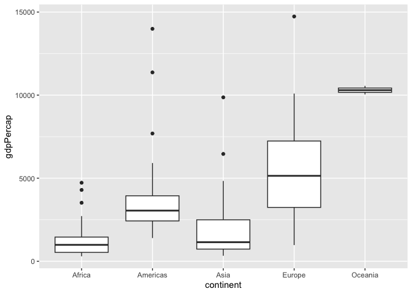
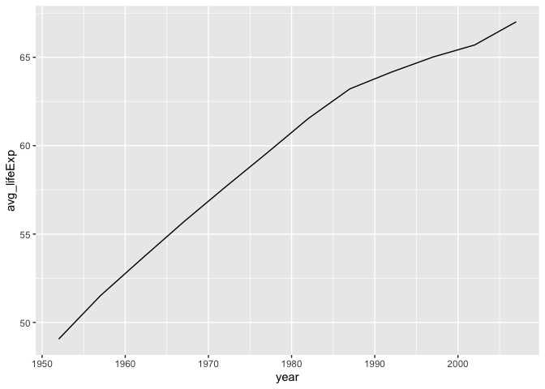

Gapminder
================
(Your name here)
2020-

- [Grading Rubric](#grading-rubric)
  - [Individual](#individual)
  - [Submission](#submission)
- [Guided EDA](#guided-eda)
  - [**q0** Perform your “first checks” on the dataset. What variables
    are in
    this](#q0-perform-your-first-checks-on-the-dataset-what-variables-are-in-this)
  - [**q1** Determine the most and least recent years in the `gapminder`
    dataset.](#q1-determine-the-most-and-least-recent-years-in-the-gapminder-dataset)
  - [**q2** Filter on years matching `year_min`, and make a plot of the
    GDP per capita against continent. Choose an appropriate `geom_` to
    visualize the data. What observations can you
    make?](#q2-filter-on-years-matching-year_min-and-make-a-plot-of-the-gdp-per-capita-against-continent-choose-an-appropriate-geom_-to-visualize-the-data-what-observations-can-you-make)
  - [**q3** You should have found *at least* three outliers in q2 (but
    possibly many more!). Identify those outliers (figure out which
    countries they
    are).](#q3-you-should-have-found-at-least-three-outliers-in-q2-but-possibly-many-more-identify-those-outliers-figure-out-which-countries-they-are)
  - [**q4** Create a plot similar to yours from q2 studying both
    `year_min` and `year_max`. Find a way to highlight the outliers from
    q3 on your plot *in a way that lets you identify which country is
    which*. Compare the patterns between `year_min` and
    `year_max`.](#q4-create-a-plot-similar-to-yours-from-q2-studying-both-year_min-and-year_max-find-a-way-to-highlight-the-outliers-from-q3-on-your-plot-in-a-way-that-lets-you-identify-which-country-is-which-compare-the-patterns-between-year_min-and-year_max)
- [Your Own EDA](#your-own-eda)
  - [**q5** Create *at least* three new figures below. With each figure,
    try to pose new questions about the
    data.](#q5-create-at-least-three-new-figures-below-with-each-figure-try-to-pose-new-questions-about-the-data)

*Purpose*: Learning to do EDA well takes practice! In this challenge
you’ll further practice EDA by first completing a guided exploration,
then by conducting your own investigation. This challenge will also give
you a chance to use the wide variety of visual tools we’ve been
learning.

<!-- include-rubric -->

# Grading Rubric

<!-- -------------------------------------------------- -->

Unlike exercises, **challenges will be graded**. The following rubrics
define how you will be graded, both on an individual and team basis.

## Individual

<!-- ------------------------- -->

| Category | Needs Improvement | Satisfactory |
|----|----|----|
| Effort | Some task **q**’s left unattempted | All task **q**’s attempted |
| Observed | Did not document observations, or observations incorrect | Documented correct observations based on analysis |
| Supported | Some observations not clearly supported by analysis | All observations clearly supported by analysis (table, graph, etc.) |
| Assessed | Observations include claims not supported by the data, or reflect a level of certainty not warranted by the data | Observations are appropriately qualified by the quality & relevance of the data and (in)conclusiveness of the support |
| Specified | Uses the phrase “more data are necessary” without clarification | Any statement that “more data are necessary” specifies which *specific* data are needed to answer what *specific* question |
| Code Styled | Violations of the [style guide](https://style.tidyverse.org/) hinder readability | Code sufficiently close to the [style guide](https://style.tidyverse.org/) |

## Submission

<!-- ------------------------- -->

Make sure to commit both the challenge report (`report.md` file) and
supporting files (`report_files/` folder) when you are done! Then submit
a link to Canvas. **Your Challenge submission is not complete without
all files uploaded to GitHub.**

``` r
library(tidyverse)
```

    ## ── Attaching core tidyverse packages ──────────────────────── tidyverse 2.0.0 ──
    ## ✔ dplyr     1.1.4     ✔ readr     2.1.5
    ## ✔ forcats   1.0.0     ✔ stringr   1.5.1
    ## ✔ ggplot2   3.5.1     ✔ tibble    3.2.1
    ## ✔ lubridate 1.9.4     ✔ tidyr     1.3.1
    ## ✔ purrr     1.0.2     
    ## ── Conflicts ────────────────────────────────────────── tidyverse_conflicts() ──
    ## ✖ dplyr::filter() masks stats::filter()
    ## ✖ dplyr::lag()    masks stats::lag()
    ## ℹ Use the conflicted package (<http://conflicted.r-lib.org/>) to force all conflicts to become errors

``` r
library(ggplot2)
library(gapminder)
```

*Background*: [Gapminder](https://www.gapminder.org/about-gapminder/) is
an independent organization that seeks to educate people about the state
of the world. They seek to counteract the worldview constructed by a
hype-driven media cycle, and promote a “fact-based worldview” by
focusing on data. The dataset we’ll study in this challenge is from
Gapminder.

# Guided EDA

<!-- -------------------------------------------------- -->

First, we’ll go through a round of *guided EDA*. Try to pay attention to
the high-level process we’re going through—after this guided round
you’ll be responsible for doing another cycle of EDA on your own!

### **q0** Perform your “first checks” on the dataset. What variables are in this

dataset?

``` r
## TASK: Do your "first checks" here!
head(gapminder)
```

    ## # A tibble: 6 × 6
    ##   country     continent  year lifeExp      pop gdpPercap
    ##   <fct>       <fct>     <int>   <dbl>    <int>     <dbl>
    ## 1 Afghanistan Asia       1952    28.8  8425333      779.
    ## 2 Afghanistan Asia       1957    30.3  9240934      821.
    ## 3 Afghanistan Asia       1962    32.0 10267083      853.
    ## 4 Afghanistan Asia       1967    34.0 11537966      836.
    ## 5 Afghanistan Asia       1972    36.1 13079460      740.
    ## 6 Afghanistan Asia       1977    38.4 14880372      786.

``` r
glimpse(gapminder)
```

    ## Rows: 1,704
    ## Columns: 6
    ## $ country   <fct> "Afghanistan", "Afghanistan", "Afghanistan", "Afghanistan", …
    ## $ continent <fct> Asia, Asia, Asia, Asia, Asia, Asia, Asia, Asia, Asia, Asia, …
    ## $ year      <int> 1952, 1957, 1962, 1967, 1972, 1977, 1982, 1987, 1992, 1997, …
    ## $ lifeExp   <dbl> 28.801, 30.332, 31.997, 34.020, 36.088, 38.438, 39.854, 40.8…
    ## $ pop       <int> 8425333, 9240934, 10267083, 11537966, 13079460, 14880372, 12…
    ## $ gdpPercap <dbl> 779.4453, 820.8530, 853.1007, 836.1971, 739.9811, 786.1134, …

``` r
summary(gapminder)
```

    ##         country        continent        year         lifeExp     
    ##  Afghanistan:  12   Africa  :624   Min.   :1952   Min.   :23.60  
    ##  Albania    :  12   Americas:300   1st Qu.:1966   1st Qu.:48.20  
    ##  Algeria    :  12   Asia    :396   Median :1980   Median :60.71  
    ##  Angola     :  12   Europe  :360   Mean   :1980   Mean   :59.47  
    ##  Argentina  :  12   Oceania : 24   3rd Qu.:1993   3rd Qu.:70.85  
    ##  Australia  :  12                  Max.   :2007   Max.   :82.60  
    ##  (Other)    :1632                                                
    ##       pop              gdpPercap       
    ##  Min.   :6.001e+04   Min.   :   241.2  
    ##  1st Qu.:2.794e+06   1st Qu.:  1202.1  
    ##  Median :7.024e+06   Median :  3531.8  
    ##  Mean   :2.960e+07   Mean   :  7215.3  
    ##  3rd Qu.:1.959e+07   3rd Qu.:  9325.5  
    ##  Max.   :1.319e+09   Max.   :113523.1  
    ## 

``` r
gapminder_fil <-
  filter(gapminder, year == 1952) %>% 
  filter(continent == "Asia")
gapminder_fil
```

    ## # A tibble: 33 × 6
    ##    country          continent  year lifeExp       pop gdpPercap
    ##    <fct>            <fct>     <int>   <dbl>     <int>     <dbl>
    ##  1 Afghanistan      Asia       1952    28.8   8425333      779.
    ##  2 Bahrain          Asia       1952    50.9    120447     9867.
    ##  3 Bangladesh       Asia       1952    37.5  46886859      684.
    ##  4 Cambodia         Asia       1952    39.4   4693836      368.
    ##  5 China            Asia       1952    44   556263527      400.
    ##  6 Hong Kong, China Asia       1952    61.0   2125900     3054.
    ##  7 India            Asia       1952    37.4 372000000      547.
    ##  8 Indonesia        Asia       1952    37.5  82052000      750.
    ##  9 Iran             Asia       1952    44.9  17272000     3035.
    ## 10 Iraq             Asia       1952    45.3   5441766     4130.
    ## # ℹ 23 more rows

**Observations**:

- `country`: string representing the name of a country
- `continent`: string representing presumably the continent of that
  country
- `year`: integer representing a year, presumably when the proceeding
  data was captured.
- `lifeExp`: double value, likely the average life expectancy of a
  person living in the prior-specified country in the prior-specified
  year
- `pop`: integer representing the population of `country` in `year`
- `gdpPercap`: the gross domestic product per capita in `country` in
  `year`

### **q1** Determine the most and least recent years in the `gapminder` dataset.

*Hint*: Use the `pull()` function to get a vector out of a tibble.
(Rather than the `$` notation of base R.)

``` r
## TASK: Find the largest and smallest values of `year` in `gapminder`
year_max <-
  gapminder %>% 
  select(year) %>% 
  max()
year_min <-
  gapminder %>% 
  select(year) %>% 
  min()

year_max
```

    ## [1] 2007

``` r
year_min
```

    ## [1] 1952

Use the following test to check your work.

``` r
## NOTE: No need to change this
assertthat::assert_that(year_max %% 7 == 5)
```

    ## [1] TRUE

``` r
assertthat::assert_that(year_max %% 3 == 0)
```

    ## [1] TRUE

``` r
assertthat::assert_that(year_min %% 7 == 6)
```

    ## [1] TRUE

``` r
assertthat::assert_that(year_min %% 3 == 2)
```

    ## [1] TRUE

``` r
if (is_tibble(year_max)) {
  print("year_max is a tibble; try using `pull()` to get a vector")
  assertthat::assert_that(False)
}

print("Nice!")
```

    ## [1] "Nice!"

### **q2** Filter on years matching `year_min`, and make a plot of the GDP per capita against continent. Choose an appropriate `geom_` to visualize the data. What observations can you make?

You may encounter difficulties in visualizing these data; if so document
your challenges and attempt to produce the most informative visual you
can.

``` r
## TASK: Create a visual of gdpPercap vs continent

gapminder %>% 
  filter(year == year_min) %>% 
  filter(country != "Kuwait") %>% 
  ggplot(aes(x = continent, y = gdpPercap)) +
  geom_point()
```

<!-- -->

``` r
gapminder %>% 
  filter(year == year_min) %>% 
  filter(country != "Kuwait") %>% 
  ggplot(aes(x = continent, y = gdpPercap)) +
  geom_boxplot()
```

<!-- -->

Note on this plot: the country of Kuwait in Asia is excluded due to the
significantly higher magnitude of its GDP, \$108,382.

**Observations**:

- Africa has the lowest median and quartiles of GDP, although there are
  several outlier values and a longer whisker of higher values more
  consistent with other, more developed continents.
- Oceania has by far the lowest variation between the lower and upper
  quartiles, likely due to the very small number of countries inside.
  Further, this creates by far the highest mean compared to other
  countries - the only values on-par are the Americas outliers and the
  very tip of the European upper whisker.
- Europe has both the highest median and largest variation between upper
  and lower quartiles, alongside the longest wiskers on the boxplot.
- The Americas have particularly large outlier GDPs.
- While Kuwait is by far the highest GDP, Europe has the next highest
  GDP per capita with its singular, quite large outlier point.

**Difficulties & Approaches**:

- The most pressing challenge I ran into was that of Kuwait, which has a
  GDP astronomically higher than any other country in the dataset and
  requires such a large y-axis that the rest of the data basically
  becomes unreadable.
  - I decided that excluding Kuwait and explicitly calling out its
    absence under the plot was the most effective way to display every
    other country’s GDP accurately.
- I tried starting with `geom_point`, but I felt there was a more
  descriptive way to show the data other than the densely packed points
  that dominated parts of the graph. I decided on a boxplot since it
  would give a better idea of the median value and still include various
  outliers.

### **q3** You should have found *at least* three outliers in q2 (but possibly many more!). Identify those outliers (figure out which countries they are).

``` r
## TASK: Identify the outliers from q2
large_outlier <-
  gapminder %>% 
  filter(year == year_min) %>% 
  arrange(desc(gdpPercap))

large_outlier
```

    ## # A tibble: 142 × 6
    ##    country        continent  year lifeExp       pop gdpPercap
    ##    <fct>          <fct>     <int>   <dbl>     <int>     <dbl>
    ##  1 Kuwait         Asia       1952    55.6    160000   108382.
    ##  2 Switzerland    Europe     1952    69.6   4815000    14734.
    ##  3 United States  Americas   1952    68.4 157553000    13990.
    ##  4 Canada         Americas   1952    68.8  14785584    11367.
    ##  5 New Zealand    Oceania    1952    69.4   1994794    10557.
    ##  6 Norway         Europe     1952    72.7   3327728    10095.
    ##  7 Australia      Oceania    1952    69.1   8691212    10040.
    ##  8 United Kingdom Europe     1952    69.2  50430000     9980.
    ##  9 Bahrain        Asia       1952    50.9    120447     9867.
    ## 10 Denmark        Europe     1952    70.8   4334000     9692.
    ## # ℹ 132 more rows

``` r
oceania <-
  gapminder %>% 
  filter(year == year_min) %>% 
  filter(continent == "Oceania")

oceania
```

    ## # A tibble: 2 × 6
    ##   country     continent  year lifeExp     pop gdpPercap
    ##   <fct>       <fct>     <int>   <dbl>   <int>     <dbl>
    ## 1 Australia   Oceania    1952    69.1 8691212    10040.
    ## 2 New Zealand Oceania    1952    69.4 1994794    10557.

**Observations**:

- Identify the outlier countries from q2
  - As discussed in the previous quesiton, Kuwait is the major outlier
    with a huge GDP relative to that of our countries.
  - In Europe, Switzerland is the large outlier where the GDP is
    significantly larger than that of our countries.
  - In the Americas, the US is the large outlier for highest GDP. Canada
    and Venezuela are also fairly large outliers.
  - Oceania is an outlier as it only contains two countries and both
    countries are quite close in GDP. As such, there is very little
    variation. in the quartiles/outliers/etc.

*Hint*: For the next task, it’s helpful to know a ggplot trick we’ll
learn in an upcoming exercise: You can use the `data` argument inside
any `geom_*` to modify the data that will be plotted *by that geom
only*. For instance, you can use this trick to filter a set of points to
label:

``` r
## NOTE: No need to edit, use ideas from this in q4 below
gapminder %>%
  filter(year == max(year)) %>%

  ggplot(aes(continent, lifeExp)) +
  geom_boxplot() +
  geom_point(
    data = . %>% filter(country %in% c("United Kingdom", "Japan", "Zambia")),
    mapping = aes(color = country),
    size = 2
  )
```

<!-- -->

### **q4** Create a plot similar to yours from q2 studying both `year_min` and `year_max`. Find a way to highlight the outliers from q3 on your plot *in a way that lets you identify which country is which*. Compare the patterns between `year_min` and `year_max`.

*Hint*: We’ve learned a lot of different ways to show multiple
variables; think about using different aesthetics or facets.

``` r
## TASK: Create a visual of gdpPercap vs continent
gapminder %>%
  filter(year == year_min | year == year_max) %>% 
  mutate(year = as.factor(year)) %>% 
  ggplot(aes(x = continent, y = gdpPercap, fill = year)) +
  geom_boxplot() +
  geom_point(
    data = . %>% filter(country %in% c("Kuwait", "Switzerland", "United States")),
    mapping = aes(color = country, fill = year),
    size = 2,
    position = position_dodge(width = 0.75)
  )
```

<!-- -->

**Observations**:

- GDP per capita median and upper quartiles increased in every continent
  between the two years.
- All continents have wider quartiles in 2007 than in 1952, but this is
  especially true in Europe and Asia.
- The magnitude by which Kuwait is an outlier is drastically reduced
  from 1952 to 2007.
- Switzerland is no longer an outlier to the extent it once was, and
  there are other outlier countries with higher GDPs per capita.
- There are only two large outliers in the Americas, and the US is still
  much ahead of the continent as a whole.

# Your Own EDA

<!-- -------------------------------------------------- -->

Now it’s your turn! We just went through guided EDA considering the GDP
per capita at two time points. You can continue looking at outliers,
consider different years, repeat the exercise with `lifeExp`, consider
the relationship between variables, or something else entirely.

### **q5** Create *at least* three new figures below. With each figure, try to pose new questions about the data.

``` r
## TASK: Your first graph
gapminder %>% 
  filter(year == year_min | year == year_max) %>% 
  mutate(year = as.factor(year)) %>% 
  ggplot(aes(continent, lifeExp, fill = year)) +
  geom_boxplot()
```

<!-- -->

- Between 1952 and 2007, life expectancy increased across every
  continent.
- In 2007, Africa has by far the largest modern variation in life
  expectancy, with ages ranging from under 40 to the upper 70s.
- Oceania has the highest median life expectancy in 2007, but the
  largest outliers are in Asia.
- With the exception of Africa, the variation between the upper/lower
  quartiles and the extreme outliers has decreased from 1952 to 2007.
- Upon initial inspection, Asia has seem to have made the largest jump
  from 1952 to 2007 in terms of median life expectancy.

``` r
## TASK: Your second graph
gapminder %>% 
  group_by(year) %>% 
  summarize(avg_lifeExp = mean(lifeExp)) %>% 
  ggplot(aes(year, avg_lifeExp)) +
  geom_line()
```

<!-- -->

- When looking at an average of data across the entire world, life
  expectancy has increased every year that the survey was conducted.
- The life expectancy has increased fairly linearly year over year from
  1952 until 1990, where it has fluctuated slightly more since.
- The raw increase in average life expectancy is roughly 20 years from
  1952 to 2007.

``` r
## TASK: Your third graph
gapminder %>% 
  filter(year == year_max) %>% 
  ggplot(aes(gdpPercap, lifeExp, color = continent)) +
  geom_point()
```

<!-- -->

- (Your notes and observations here)
- For this visualization, I wanted to compare the relationship between
  GDP per capita and the life expectancy of a country. Additionally, I
  added in the content to see what groups existed here.
- I choose to use only the most recent year given it would contain the
  most medical advancements.
- Overall, there is a trend of increasing life expectancy with
  increasing GDP per capita. However, the most important feature of this
  visualization are:
  - The dramatically lower, and varying, life expectantcies in Africa,
    which are much more widely varying and low than those of other
    continents. This suggests that there are other factors unique to
    Africa other than GDP that is causing lower life expectancy other
    than strictly economic conditions indicated by the GDP.
  - After \$5000 of GDP per capita, the dramatic gains are reduced to
    very gradual or no gains and most values sit between 70-75 years
    old. There is another jump at \$20,000 GDP per capita to the 75-low
    80s range.
- Overall, I would like to look at more data around the life expectancy
  to determine if there is a clearer economic correlation. I would like
  to look at data describing the causes of death in each country and the
  ratio of deaths that are caused by “preventable” diseases.
